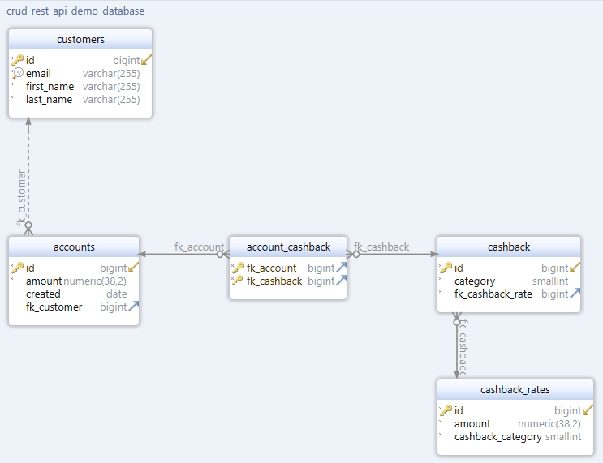

# Spring Boot + JPA and Hibernate + PostgreSQL RESTful CRUD API demo project

## Introduction
I`m exited to introduce you my journey through Java and Spring technologies to Software Engineer knowledge and experience.
I prefer to dig into all possible advantages / disadvantages when write every line of code.
This is my best code right now, every day I work to improve it.

Despite the fact that the Spring Documentation [recommends](https://docs.spring.io/spring-boot/docs/current/reference/html/using.html#using.structuring-your-code) using the Package by Feature project structure, 
in my application I have chosen the Package by Layer structure, 
because this is how it is implemented in the book of Craig Walls "Spring in Action".

## Running application locally
You can build a jar file and run it from the command line (it should work just as well with Java 17 or newer):
```
git clone https://github.com/malouhov/crud-rest-api-demo.git
cd crud-rest-api-demo
./mvnw package
java -jar target/*.jar
```
You can then access my application at http://localhost:8080/
Or you can run it from Maven directly using the Spring Boot Maven plugin:
```
./mvnw spring-boot:run
```

## Description
The following are the endpoints of API:</br>

| Method | Path                 | Description                 |            
|--------|----------------------|-----------------------------|
| POST   | /api/v1/customers    | create new customer         |
| GET    | /api/v1/customers/id | retrieve a customer by {id} |
| GET    | /api/v1/customers    | retrieve all customers      |
| PUT    | /api/v1/customers/id | update a customer by {id}   |
| DELETE | /api/v1/customers/id | delete a customer by {id}   |
| DELETE | /api/v1/customers    | delete all customers        |

## Database configuration
My application use PostgreSQL database. You can create database locally using:
```
createdb -h localhost -p 5432 -U postgres crud-rest-api-demo-database
password ****
```

Database schema is shown bellow.



## Project backlog
:ok_hand: MVP: Customer Entity, Service, Repository, Controller and database setup</br>
:ok_hand: Test Repository and Controller</br>
:construction_worker: Override equals() and hashCode() + test using github.com/jqno/equalsverifier</br>
:ok_hand: Implement JPA One-To-One + One-To-Many + Many-To-Many mapping</br>
:ok_hand: Load initial data to the database using data.sql</br>
:construction_worker: Add complex queue with JOIN to the Repository, Service and Controller</br>
:ok_hand: Refactor Controller using DTO and implement MapStruct mapper</br>
:ok_hand: Add validation to the Controller</br>
:ok_hand: Handle rest exceptions using ExceptionHandler</br>
:construction_worker: Add logging using AOP</br>
:construction_worker: Dockerize application</br>

## References
1. [Walls, Craig (2022). Spring in Action, Sixth Edition. Manning Publications. ISBN 9781617297571](https://www.manning.com/books/spring-in-action-sixth-edition)</br>
2. [Spring Boot Reference Documentation section Using Spring Boot chapter 2. Structuring Your Code](https://docs.spring.io/spring-boot/docs/current/reference/html/using.html#using.structuring-your-code)</br>
3. [Spring Boot Best Practices for Developers](https://medium.com/@raviyasas/spring-boot-best-practices-for-developers-3f3bdffa0090)</br>
4. [Building REST services with Spring](https://spring.io/guides/tutorials/rest/)</br>
5. [Lombok & Hibernate: How to Avoid Common Pitfalls](https://thorben-janssen.com/lombok-hibernate-how-to-avoid-common-pitfalls/)</br>
6. [Ultimate Guide to Implementing equals() and hashCode() with Hibernate](https://thorben-janssen.com/ultimate-guide-to-implementing-equals-and-hashcode-with-hibernate/)</br>
7. [Hibernate @NotNull vs @Column(nullable = false)](https://www.baeldung.com/hibernate-notnull-vs-nullable)</br>
8. [Unit Testing with Spring Boot article series](https://reflectoring.io/unit-testing-spring-boot/)</br>
9. [Spring Boot MockMVC Example](https://howtodoinjava.com/spring-boot2/testing/spring-boot-mockmvc-example/)</br>
10. [Map Associations with JPA and Hibernate – The Ultimate Guide](https://thorben-janssen.com/ultimate-guide-association-mappings-jpa-hibernate/)</br>
11. [Entity Mappings: Introduction to JPA FetchTypes](https://thorben-janssen.com/entity-mappings-introduction-jpa-fetchtypes/)</br>
12. [The DTO Pattern (Data Transfer Object)](https://www.baeldung.com/java-dto-pattern)</br>
13. [Mapping JPA Entities into DTOs in Spring Boot Using MapStruct](https://auth0.com/blog/how-to-automatically-map-jpa-entities-into-dtos-in-spring-boot-using-mapstruct/)</br>
14. [Jackson – Bidirectional Relationships](https://www.baeldung.com/jackson-bidirectional-relationships-and-infinite-recursion)</br>
15. [Validation with Spring Boot - the Complete Guide](https://reflectoring.io/bean-validation-with-spring-boot/)</br>
16. [How to persist creation and update timestamps with Hibernate](https://thorben-janssen.com/persist-creation-update-timestamps-hibernate/)</br>
17. [Quick Guide on Loading Initial Data with Spring Boot](https://www.baeldung.com/spring-boot-data-sql-and-schema-sql)</br>
18. [Derived Query Methods in Spring Data JPA Repositories](https://www.baeldung.com/spring-data-derived-queries)</br>
19. [Advanced exception handling in Spring Boot](https://hyperskill.org/learn/step/19855)</br>
20. [Complete Guide to Exception Handling in Spring Boot](https://reflectoring.io/spring-boot-exception-handling/)</br>
21. [Error Handling for REST with Spring](https://www.baeldung.com/exception-handling-for-rest-with-spring)</br>
22. [Unit Testing with Spring Boot](https://reflectoring.io/unit-testing-spring-boot/)</br>
23. [Docker : Zero to Hero (with SpringBoot + Postgres)](https://isurunuwanthilaka.medium.com/docker-zero-to-hero-with-springboot-postgres-e0b8c3a4dccb)</br>
22. [Running Spring Boot with PostgreSQL in Docker Compose](https://www.baeldung.com/spring-boot-postgresql-docker)</br>
23. [DB Integration Tests with Spring Boot and Testcontainers](https://www.baeldung.com/spring-boot-testcontainers-integration-test)</br>
24. [Look at this: Testing Web, Service and Dao Layers in Spring Boot](https://howtodoinjava.com/spring-boot2/testing/spring-boot-2-junit-5/)</br>
25. [Look at this: Testcontainers with JUnit 5 and Spring Boot](https://howtodoinjava.com/spring-boot/testcontainers-with-junit-and-spring-boot/)</br>
26. [Look at this: Docker : Zero to Hero (with SpringBoot + Postgres)](https://isurunuwanthilaka.medium.com/docker-zero-to-hero-with-springboot-postgres-e0b8c3a4dccb)</br>
27. [Look at this: Unit Testing the Service Layer of Spring boot Application](https://1kevinson.com/testing-service-spring-boot/)</br>
